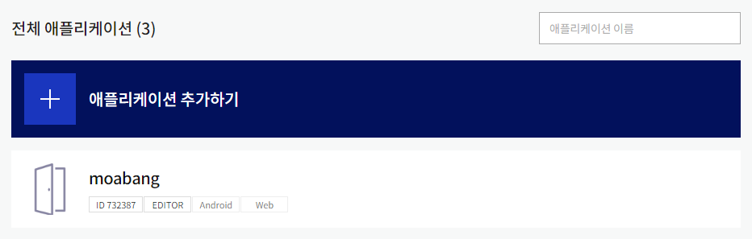
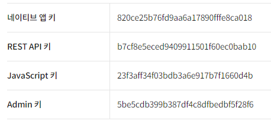
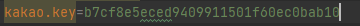
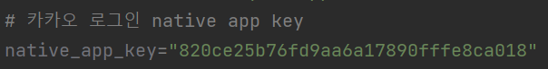
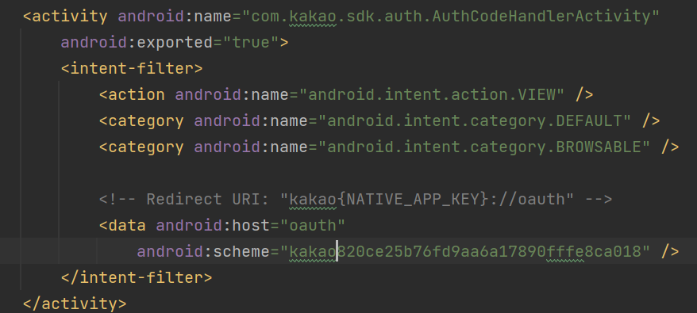
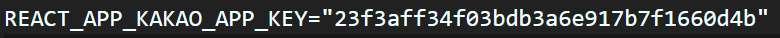
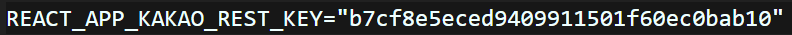
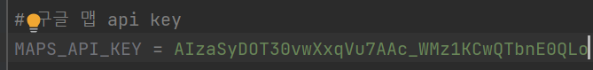

1. 카카오 디벨로퍼에서 애플리케이션 추가하기

2. SpringBoot의 application.properties에 kakao.key 부분을 REST API 키로 바꿔준다.

   

3. Android 소셜 로그인을 위해 local.properties 에 네이티브 앱 키를 추가

   

4. Android 소셜 로그인을 위해 manifest 에 네이티브 앱 키를 추가

   

5. React 소셜 로그인을 위해 .env부분을 JavaScript키로 바꿔준다.

   

6. React의 .env 부분에 kakao map을 활용하기 위해서 바꿔준다.

   

7. Android의 Google map을 활용하기 위해 local.properties에 api 키 추가.

   

   

   
