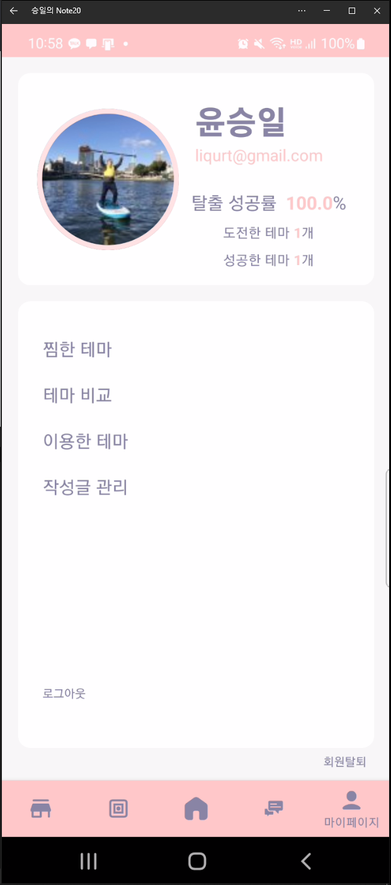
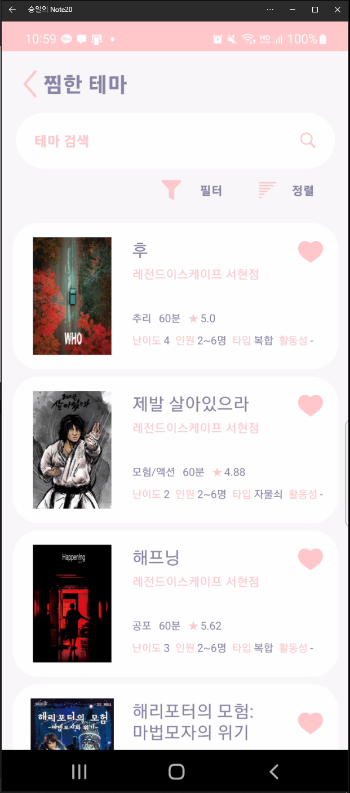

안드로이드 및 Web에서의 기능 및 동작은 똑같기에 안드로이드 기반으로 설명합니다.

- 주변에 있는 방탈출 카페 정보(위치 및 거리, 카페 이름 등)를 보여주는 부분.

  </img>

  - 필터 부분을 클릭 시 아래와 같이 지역에 따라 필터 가능.

    </img>

- 구글 맵(Android), 카카오 맵(Web) 등 Maps의 기능을 활용해 해당 테마의 위치 정보 및 카페 정보를 알려주며 위치 우측 확대 버튼을 클릭시 각 화면에 크기에 따라 총 개수 및 카페명 클릭시 이동 가능하며 지도에서 자신의 현 위치를 확인 가능.

  </img></img></img>

- 카페 정보 하단 부분에 속해있는 테마 정보들이 뜨며 해당 테마 클릭 시 테마 상세 페이지로 이동.

  </img>

### 🏆테마 정보.

- 테마별로  정렬한 항목을 볼 수 있으며 좋아요 클릭 시 마이페이지에서 좋아요 한 테마 목록 확인 가능.

  </img>

- 테마별 필터를 적용하여 원하는 항목의 테마들의 리스트를 볼 수 있음.

  </img>

- 해당 테마 클릭시 테마의 상세 내용 및 리뷰통계, 리뷰를 확인 가능.

  </img>

  - 해당 홈페이지 버튼 클릭 시 바텀 시트에 웹뷰를 통해서 해당 카페로 이동 가능.

    </img>

### 📃리뷰 정보

- 해당 테마에 대한 리뷰의 통계 정보 및  리뷰를 통해 사용자의 주관적인 의견을 확인 할 수 있으며 수정, 삭제, 신고 가능.

  </img>

- 이용한 테마에 대한 리뷰를 작성하는 부분.

  </img>

### 📃**테마  비교**

- 각 테마에서 비교하기를 누르면 비교 리스트 각 테마가 들어감.

  </img>

  - 마이페이지의 비교하기에 넣은 리스트 중 최대3개까지 항목을 차트를 통해 비교하여 확인 가능.

    </img>

### 🏆커뮤니티.

- 커뮤니티를 통해서 해당 사이트의 공지, 구인, 자유 게시판 등 확인 가능.

  </img>

- 게시글 작성 및 수정을 할 수 있는 부분.

  </img> 

- 게시글 댓글을 작성할 수 있으며 삭제 및 수정 가능.
  </img>

### 🏆마이 페이지

- 해당 유저가 찜한 테마, 테마  비교, 이용한 테마, 작성글 관리 등 이 가능.

  마이 페이지 메인 화면 부분.

  </img>

  테마 비교 (최대 3개까지)부분.

  </img>

  찜한 테마 목록 확인 부분.

  </img>

  이용한 테마 확인 부분.

  </img>

  